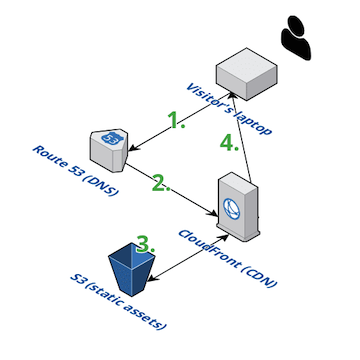

Hello, and welcome to my first post on my first website. For a little context I do a lot of server-side programming & AWS management at my job, which I really enjoy! So much so that I even got my [first AWS certification](https://www.certmetrics.com/amazon/public/badge.aspx?i=1&t=c&d=2019-03-26&ci=AWS00677740) about a month ago. I got the inspiration to create a personal website when, as part of my certification exam prep, I learned that Amazon's S3 storage service can be configured to [statically serve web content](https://docs.aws.amazon.com/AmazonS3/latest/dev/WebsiteHosting.html) (it's durable, scalable, and very, very cheap!). This seemed like a great chance to 1) practice for my exam and 2) get my hands dirty implementing cloud infrastructure outside of work. And that's what I'd like to cover in this first post - what AWS puzzles pieces are put together to get this content from some machine in Oregon to your laptop / etc. I'll briefly cover how I made the content look nice, but expect the coverage of front-end / back-end implementation to match my own understanding. 🔬

## Make it look good with Gatsby
You may have noticed the large purple "G" somewhere on the left-hand sidebar. This site is generated by [Gatsby JS](https://www.gatsbyjs.org/), which is a React JS framework for building fast, pre-built static web apps. It features a rich collection of community-driven templates (including the one I used for [this site](https://www.gatsbyjs.org/starters/email2vimalraj/gatsby-starter-tech-blog/)) that makes rapid prototyping as simple as adding a Markdown file for a new blog post in `src/blog-posts` and changing some lines in `gatsby-config.js`. Gatsby then bundles all your text + images + Node modules + etc. into static assets to be served... somehow. Cue the architecture diagram! 📐

## Make it scale with Amazon
Now to get into the nuts & bolts, the show behind the scenes. But before we start look at any pictures there are a few concepts / Internet technologies to briefly discuss, such as
* **DNS** == **D**omain **N**ame **S**ervice. This is how computers translate human-friendly names (`www.cnn.com`) into computer-friendly resources like IP addresses (ex. `127.0.0.1`). Route 53 is Amazon's managed DNS service that lets you create your own name mappings.
* **CDN** == **C**ontent **D**istribution **N**etwork. Rather than having to fetch something via the Internet that's stored halfway around the world, CDN's store local copies of images, webpages, etc. to safe traffic on the Internet and give people faster load times. CloudFront is Amazon's managed CDN service that lets you create your own _distribution_ that leverages Amazon's existing infrastructure to serve only the content you put inside it.
* **S3** == **S**imple **S**torage **S**ervice. This is something made by Amazon (the previous 2 are implemented across the Internet). S3 stores _objects_ (files of any type) in a _bucket_ with a globally unique name. Technically the buckets work as flat storage, aka like one huge folder on your computer, but giving an object a slash-delimited name like `/images/duck.png` allows you to store objects with some notion of hiearchical organization.

To give a little bit more insight on the power of CDN's, this is a map of all the locations in the world where Amazon saves copies of users' data in its CloudFront network. With this global network of caches, when someone in London visits a website that is hosted in Brazil they will take a bit longer to load the page the first time, but after that a copy of the website will be saved in one of the UK cache locations and subsequent visits (either by the same user or other ones) will have significatnly quicker response times.

Now let's see all this in action. At a high level, this web page came to be in front of your eyes like this:

Now for an example: all the text + image references in this blog post are stored in a Markdown file called `index.md`. In reality there are many Javascript components that Gatsby generates to support the sidebar, blog tags, site navigation, etc., that also need to be pulled for the site to be viewed, but for simplicity's sake let's assume that all the content we need to view the page is stored in `index.md`. What's the sequence of events that happens?

1. Someone types in `https://wtait.me/post1` into their web browser, which navigates the worldwide DNS network and arrives at Route 53, Amazon's managed DNS service
2. Route 53 finds an entry that maps the recognizable URL `https://wtait.me` to an Amazon Resource, in this case my CDN with some strange URL like `abc123def789.cloudfront.net`
3. The CloudFront CDN is set to fetch resources from an _origin_, which in this case is an S3 bucket configured for static website hosting. This gives it an accessible URL of the form `www.<bucket_name>.s3-website-<region>.amazonaws.com`. In our example's case, CloudFront finds an `index.md` file, which is recognizes as a base file to use to render the webpage
4. CloudFront saves a copy of `index.md` in its _edge locations_ to speed up future requests for the same file, then returns the file to the visitor's computer where the Markdown file is rendered into the page you're seeing

Boiled down a bit more, the request chain goes
* Laptop requests a URL (`https://wtait.me/post1`) from Route 53
* which translates that URL to a CloudFront distribution (`abc123def789.cloudfront.net`)
* which requests web content from the S3 website URL `www.<bucket_name>.s3-website-<region>.amazonaws.com`
* which S3 translates into a request for `index.md`

### Operating Cost
While this serving method certainly brings less maintenance than owning a server, would it really be worth it if it cost much more? Here's a look at some of the expenditure so far for the model I have set up.
* Route 53 DNS queries (doing the lookup for `https://wtait.me`)
    - $0.40 / 1 million requests for the first billion
    - 474 requests so far x $0.40 / 1mil requests = **$0.00**
*  Route 53 Intra-DNS Queries (converting `https://wtait.me` -> `abc123def789.cloudfront.net`)
    -  Completely free for Alias records!
    -  148 requests so far x 0 = **$0.00**
* Route 53 hosted zone (contains all name mappings under my `wtait.me` domain)
    - **$0.50** / month
* S3 GET / PUT data (retrieving `index.md`, or uploading a new copying if I wanted to update it)
    - 186 requests so far x $0.0055 / 1000 requests = **$0.00**
* S3 storage (basically my `index.md` file paying rent to live on Amazon's machines)
    - 0.001 GB-month x $0.005 / GB-month = **$0.00**

Grand total = $0.00 + $0.00 + $0.50 + $0.00 + $0.00 = **$0.50** for a month of operating with ***zero maintenance*** outside uploading any new content. Sure my storage + request costs will scale up - but very slowly, at the current rate. And even if this website miraculously went viral tomorrow (not holding my breathe) and visitors started flooding in, Amazon's DNS / storage services would scale to handle the load instead of me.

I want to call out quickly that while this post may very much sound like a big AWS ad, ***it is not!*** Amazon is simply the cloud platform I've had the most experience with so far, and so it's reasonable for me to experiment with what I know. If one has a firm grasp on the right concepts, they should be able to implement the same well-thought architecture on the cloud platform of their choosing, just with a bit of name-swapping along the way. ☁️

Thanks for reading! Maybe for the next article I'll talk about how I dealt with the dissatisfaction I felt when I first saw my website pop up in Chrome for the first time, only to be previewed by the message "Your connection is not private. Attackers might be trying to steal your information."

